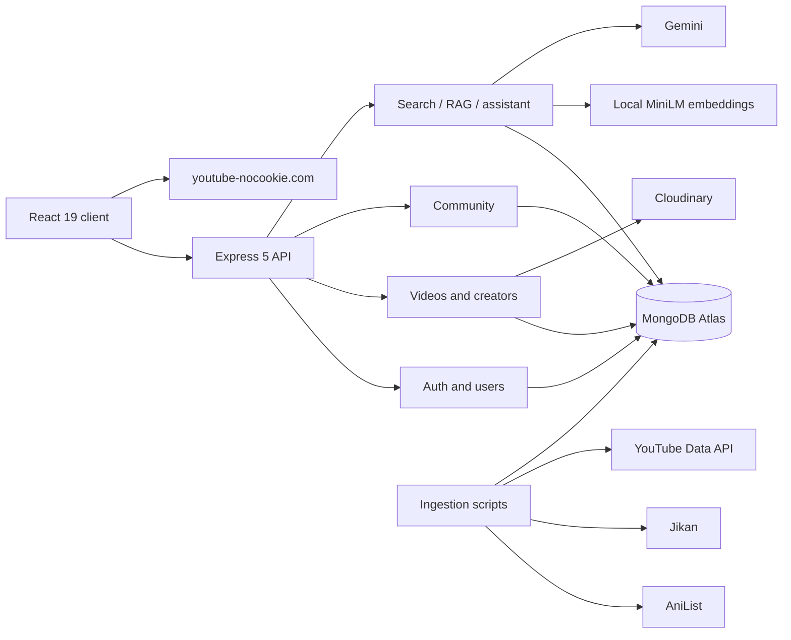

# AnimeVerse AI

AnimeVerse started as a MERN video platform and slowly turned into a place where I could experiment with search, recommendations, creator workflows, and RAG without building a separate demo for every idea.

The main problem I wanted to solve was simple: sometimes you remember a scene, character, mood, or plot detail, but not the exact anime or video title. AnimeVerse lets you search for that idea in natural language and uses the catalogue itself as context for discovery and chat.

**Live app:** https://animeverse-nsree.vercel.app/

> AnimeVerse is not a full-episode streaming service. The catalogue contains trailers, promos, openings, endings, official clips, music videos, and creator uploads. YouTube videos are stored as metadata and video IDs and are played through embeds. They are not downloaded or re-hosted.

---

## What works right now

- Natural-language anime and video search
- Local semantic embeddings with `all-MiniLM-L6-v2`
- Hybrid retrieval using semantic, anime metadata, and lexical signals
- RAG-based knowledge retrieval for the AI assistant
- Gemini-powered conversational assistant with catalogue tools
- Similar-video recommendations and discovery collections
- Personalized suggestions using likes, history, and Watch Later
- YouTube embeds and Cloudinary creator uploads
- Creator dashboard with edit, delete, and publish controls
- Channels, subscriptions, comments, playlists, likes, and history
- Community posts, replies, polls, and voting
- Voice input and browser text-to-speech
- Catalogue ingestion and quality-audit scripts
- Health checks, structured logs, rate limits, and graceful shutdown

---

## Screenshots

### Home


### AI Search

A query does not need to contain the exact anime title. For example:

```text
two brothers using alchemy to restore their bodies
```


### Discovery Lab


### AI Companion


### Community


---

## RAG and search

The first version of AnimeVerse search was mostly metadata and title based. That worked for obvious queries, but it was weak when the user only remembered a description or story detail.

I added a semantic retrieval layer and later connected it to the assistant as a grounded RAG tool.

The current flow is roughly:

```text
User query
   |
   v
Local MiniLM embedding
   |
   +--> video embedding similarity
   +--> linked anime similarity
   +--> lexical/title/character signal
   |
   v
Hybrid ranking
   |
   v
Relevant catalogue chunks/results
   |
   v
Gemini assistant when a grounded answer is needed
```

The RAG foundation includes indexing, bounded chunking, retrieval routes, grounded knowledge retrieval, and assistant tool integration.

I kept the embedding layer local because an earlier OpenAI embedding backfill hit API-credit limits. Moving to `sentence-transformers/all-MiniLM-L6-v2` made indexing predictable and removed the per-document embedding cost.

Embeddings are stored with metadata such as model, dimensions, version, generation time, and source-text hash so stale or incompatible vectors can be detected instead of silently mixed.

---

## Assistant design

The assistant does not query the database for every message.

For normal anime conversation, the configured LLM can answer directly. When the request needs AnimeVerse-specific information, the assistant can call catalogue tools such as search or platform statistics.

```text
User message
    |
    v
Does this need AnimeVerse data?
    |
    +---- no ----> conversational response
    |
    +---- yes ---> catalogue/RAG tool
                       |
                       v
                  MongoDB retrieval
                       |
                       v
                  grounded context
                       |
                       v
                    Gemini
```

There are also fallback paths for provider failures. Local retrieval remains usable even if the conversational provider is unavailable.

The assistant is intentionally not allowed to claim that it watched a YouTube video or knows an exact scene timestamp when that information is not present in the stored metadata.

---

## Catalogue pipeline

AnimeVerse uses AniList, Jikan fallback data, reviewed metadata, and the YouTube Data API to build the catalogue.

A simplified ingestion flow is:

```text
Anime metadata
    |
    v
YouTube search
    |
    v
availability / embeddability checks
    |
    v
content + entity filters
    |
    v
deduplication
    |
    v
MongoDB
    |
    v
embedding backfill
    |
    v
quality audit
```

One surprisingly annoying problem was title collision. A trusted source can still return the wrong entity. Examples I added regression coverage for include:

- `D.Gray-man` vs `The Gray Man`
- `Tokyo Ghoul` vs `Ghoul`
- `The Promised Neverland` vs `Finding Neverland`
- `Chainsaw Man` vs `Texas Chainsaw Massacre`
- `My Dress-Up Darling` vs `DARLING in the FRANXX`

For ambiguous matches, the audit flow prefers review over destructive deletion. High-confidence bad matches can be unpublished by setting `isPublished=false`.

---

## Video sources

AnimeVerse supports two video paths.

### Creator uploads

```text
upload
 -> Multer
 -> Cloudinary
 -> sourceType = "cloudinary"
 -> HTML5 video player
```

### YouTube catalogue videos

```text
YouTube Data API metadata
 -> externalVideoId
 -> sourceType = "youtube"
 -> youtube-nocookie.com embed
```

Playback is selected from `sourceType`, not from who owns the video record.

---

## Architecture



---

## Tech stack

### Frontend

- React 19
- Vite 5
- React Router
- TanStack Query
- Zustand
- Tailwind CSS
- Framer Motion
- Recharts

### Backend

- Node.js
- Express 5
- MongoDB / Mongoose
- JWT access and refresh authentication
- bcrypt
- Helmet
- CORS
- rate limiting
- Multer
- Cloudinary

### AI and data

- `@huggingface/transformers`
- `sentence-transformers/all-MiniLM-L6-v2`
- Gemini Developer API
- AniList
- Jikan
- YouTube Data API v3

---

## Project structure

```text
animeverse-ai/
├── backend/
│   ├── src/
│   │   ├── controllers/
│   │   ├── db/
│   │   ├── middlewares/
│   │   ├── models/
│   │   ├── routes/
│   │   ├── scripts/
│   │   ├── services/
│   │   └── utils/
│   ├── tests/
│   └── .env.sample
│
├── frontend/
│   └── src/
│       ├── components/
│       ├── layouts/
│       ├── pages/
│       ├── routes/
│       ├── services/
│       └── store/
│
└── docs/
    └── screenshots/
```

---

## Running locally

### Clone

```bash
git clone https://github.com/sreelekhanampally/animeverse-ai.git
cd animeverse-ai
```

### Backend

```bash
cd backend
npm install
```

Create `backend/.env` from `backend/.env.sample`.

A minimal development configuration looks like:

```env
PORT=8000
NODE_ENV=development
CORS_ORIGIN=http://localhost:5173

MONGODB_URI=...
ACCESS_TOKEN_SECRET=...
REFRESH_TOKEN_SECRET=...

GEMINI_API_KEY=...
ANIME_CHAT_PROVIDER=auto

EMBEDDING_PROVIDER=local
```

Cloudinary credentials are needed for creator uploads, and a YouTube API key is needed for ingestion scripts that call YouTube.

Run the API:

```bash
npm run dev
```

The MiniLM model may be downloaded the first time embeddings are generated. Later runs use the local model cache.

### Frontend

```bash
cd ../frontend
npm install
```

Create `frontend/.env`:

```env
VITE_API_URL=http://localhost:8000/api/v1
```

Then:

```bash
npm run dev
```

---

## Useful backend commands

```bash
# test suite
npm test

# embeddings / indexing
npm run backfill:embeddings

# catalogue checks
npm run catalog:audit
npm run catalog:audit:live

# deployment validation
npm run deploy:check
npm run deploy:check:db
```

Some catalogue scripts can modify publication state, so I keep audit and apply steps separate instead of automatically changing data during every check.

---

## API highlights

| Method | Endpoint | Purpose |
| --- | --- | --- |
| `POST` | `/api/v1/ai/semantic-search` | natural-language search |
| `POST` | `/api/v1/ai/chat` | AnimeVerse assistant |
| `GET` | `/api/v1/ai/recommendations` | personalized recommendations |
| `GET` | `/api/v1/ai/videos/:videoId/similar` | similar videos |
| `GET` | `/api/v1/ai/videos/:videoId/graph` | related-video graph |
| `POST` | `/api/v1/ai/collections` | dynamic semantic collections |
| `GET` | `/api/v1/ai/evaluation` | AI and retrieval metrics |
| `GET` | `/api/v1/healthcheck/live` | liveness |
| `GET` | `/api/v1/healthcheck/ready` | readiness |

The app also has APIs for users, channels, videos, subscriptions, likes, comments, playlists, history, Watch Later, creator tools, community posts, and replies.

---

## A few engineering choices

**Why local embeddings?**  
They are cheap, reproducible, and the catalogue does not need an external embedding request every time it is indexed.

**Why not use a vector database yet?**  
The current corpus is still small enough that MongoDB plus in-process cosine ranking keeps the system easy to run. The retrieval provider is isolated so this can be changed later if the catalogue grows enough to justify ANN search.

**Why keep YouTube as embeds?**  
AnimeVerse only needs the metadata and video ID for external catalogue items. Creator-owned uploads use Cloudinary separately.

**Why keep a quality audit pipeline?**  
Growing the catalogue is easy. Growing it without filling search results with wrong anime, duplicate trailers, reactions, edits, or unrelated videos is the harder part.

---

## Current limitations

- External YouTube understanding is based on stored metadata and linked anime information. AnimeVerse does not inspect arbitrary YouTube frames or audio.
- Some catalogue records have sparse metadata rather than generated descriptions.
- Ambiguous anime/video associations may stay in a review bucket instead of being automatically removed.
- Browser speech recognition support varies by browser.
- The current retrieval implementation favors simplicity for a low-thousands corpus over adding a separate vector database too early.

---

## License

MIT

## Author

**Sreelekha Nampally**

Full-stack developer exploring AI engineering, retrieval systems, and product development.

- GitHub: [@sreelekhanampally](https://github.com/sreelekhanampally)
- LinkedIn: [sreelekha-nampally](https://www.linkedin.com/in/sreelekha-nampally)
- Email: sreelekhanampally27@gmail.com
