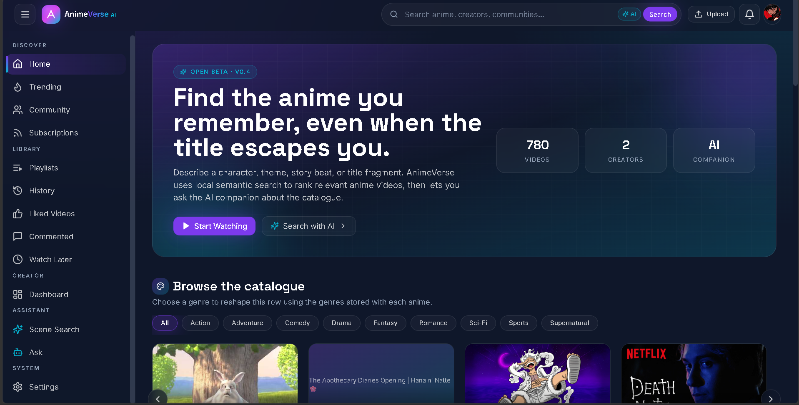
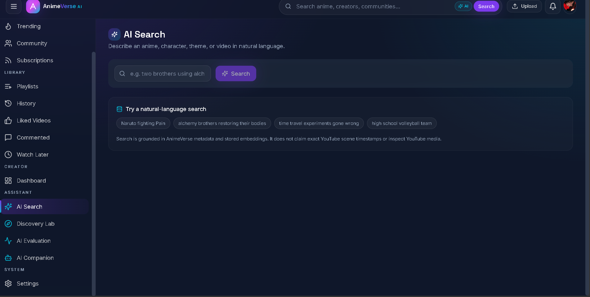
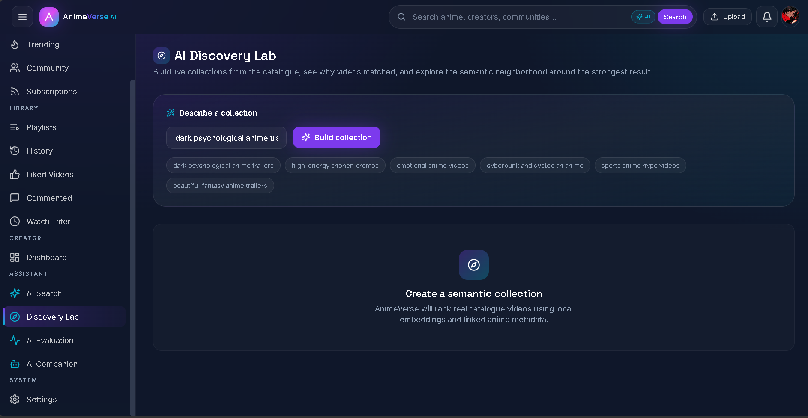
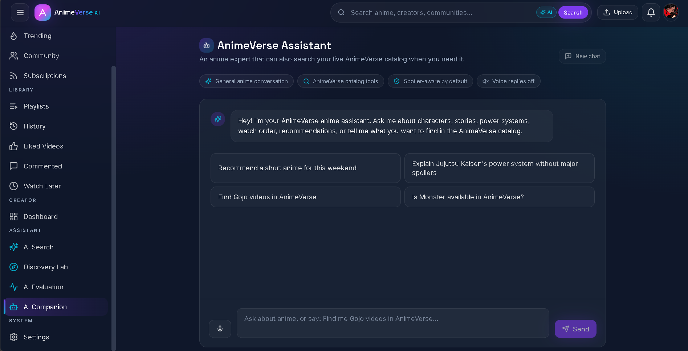
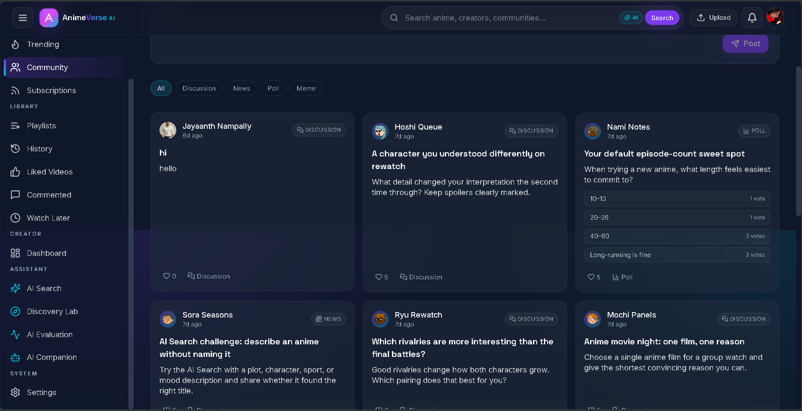
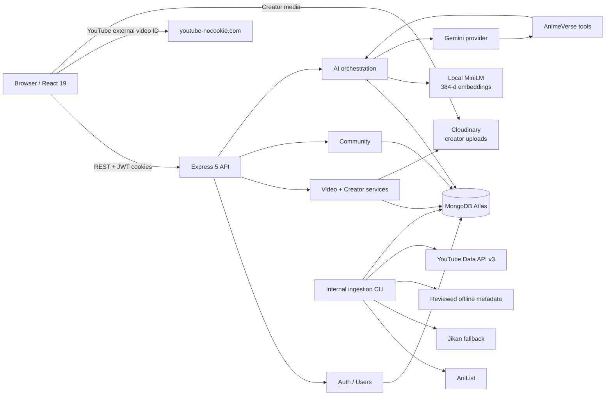
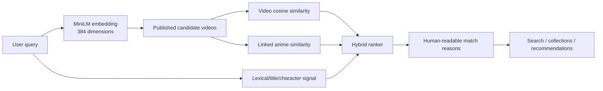
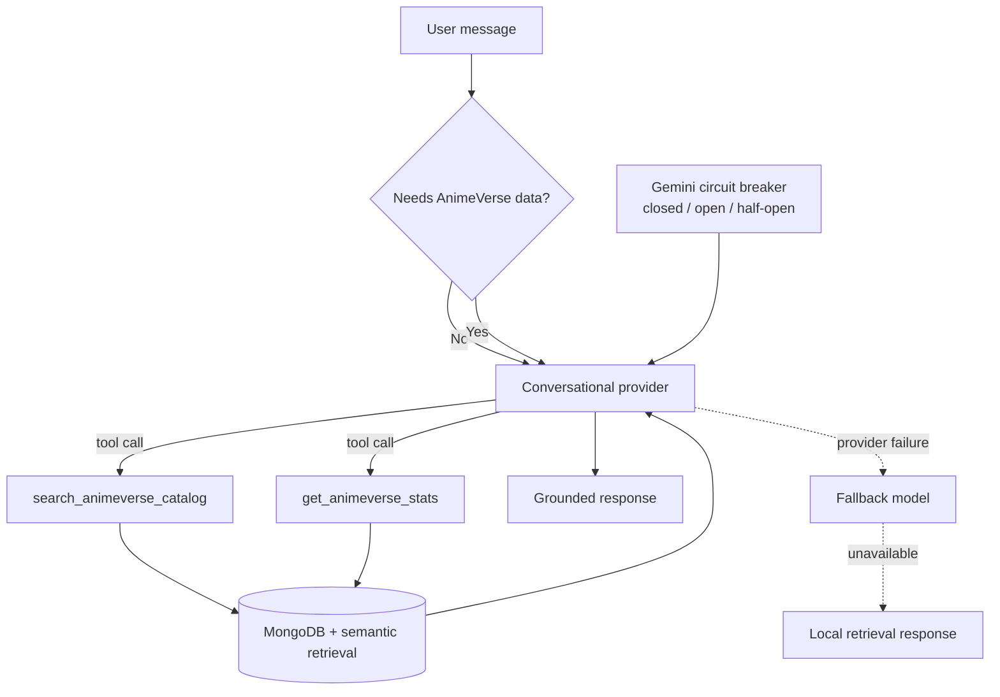

# AnimeVerse AI

**AI-native anime video discovery, creator, and community platform built with React, Express, MongoDB, local semantic embeddings, and a tool-using conversational assistant.**

AnimeVerse helps people find anime-related videos even when they do not remember the exact title. Users can search by character, theme, plot fragment, mood, or story detail; explore semantically related videos; build dynamic collections; ask an anime assistant questions; and interact with a community around the catalogue.

> AnimeVerse is **not a full-episode streaming service**. Its catalogue is built around anime trailers, promos, openings, endings, clips, music videos, and creator uploads. External YouTube videos are stored as metadata + video IDs and played through embeds. They are never downloaded or re-hosted.

## Current snapshot

Latest local catalogue/test snapshot used for this README:

| Metric | Current state |
| --- | ---: |
| Anime documents | **231** |
| Published YouTube videos | **1,907** |
| Searchable YouTube embeddings | **1,907 / 1,907 (100%)** |
| Anime metadata sources | **167 AniList + 64 curated fallback** |
| Video embedding model | **sentence-transformers/all-MiniLM-L6-v2** |
| Embedding width | **384 dimensions** |
| Automated backend tests | **235** |
| Passing | **228** |
| Failing | **0** |
| Skipped optional/live-model tests | **7** |

Catalogue size is deliberately **not** the quality target. The ingestion pipeline now audits entity association, duplicate titles, content mix, embedding health, source availability, and high-confidence false matches before growth is considered successful.

---

## Product walkthrough

### Home

The home feed combines catalogue browsing, platform statistics, personalized shelves, creator content, history, likes, Watch Later signals, and community activity.



### Natural-language AI Search

Search does not require an exact title. A query such as `two brothers using alchemy to restore their bodies` is embedded locally and ranked against AnimeVerse video + anime metadata.



### Discovery Lab

Users can build a collection around a theme, mood, genre, or style and then move through related results using the same semantic layer.



### AI Companion + voice

The assistant can answer general anime questions and, when needed, call AnimeVerse catalogue tools to search real stored videos or platform statistics. Voice input and browser text-to-speech sit on top of the same conversation flow.



### Community

Community posts support deep links, discussions, replies, polls, upvotes, filters, and user-profile navigation. Poll selections and reactions persist as real account state rather than decorative UI.



---

## Architecture



### Source-aware video architecture

```text
Creator upload
    -> Multer
    -> Cloudinary
    -> sourceType = "cloudinary"
    -> HTML5 <video>

YouTube ingestion
    -> YouTube Data API v3 metadata
    -> externalVideoId only
    -> sourceType = "youtube"
    -> youtube-nocookie.com iframe
```

The owner of a video never determines playback type. `sourceType` does.

---

## Semantic retrieval pipeline



The current ranking layer combines semantic video similarity, linked-anime context, and a secondary lexical signal. It intentionally avoids an arbitrary hard similarity floor because valid niche matches can have lower cosine values than obvious title matches.

Embeddings are stored with provenance metadata including model, dimension count, version, generation time, and source-text hash. Incompatible or stale vectors are excluded rather than silently mixed.

---

## AI Companion: provider + tool strategy



Key properties:

- Gemini is the conversational provider when configured.
- Model failover can move through configured Gemini fallback models.
- A circuit breaker stops repeatedly calling an unhealthy provider after consecutive failures.
- The assistant only exposes catalogue tools when the request actually needs AnimeVerse data.
- Local semantic retrieval remains available even without a paid embedding API.
- Retrieved catalogue text is treated as untrusted data in the assistant system prompt.
- The assistant does **not** claim to have watched YouTube media or know exact scene timestamps.

---

## AI Evaluation & observability

`/ai/evaluation` is a real engineering dashboard rather than a marketing screen.

It reports:

- video and anime embedding coverage
- embedding model/version/dimensions
- request counts and failure counts
- success rate by AI operation
- p50 and p95 latency
- observed assistant provider usage
- catalogue tool-call counts
- Gemini circuit-breaker state
- an 8-query retrieval benchmark with **Top-1, Recall@5, MRR, p50, and p95**

Benchmark values are generated from the live catalogue and are intentionally **not hard-coded into this README**, because they change as the catalogue is cleaned and expanded.

### Automated test evidence

Latest full backend run:

```text
235 tests
228 passed
0 failed
7 skipped
```

The suite includes semantic ranking, embedding compatibility, AI routing, provider fallbacks, circuit breaking, production hardening, community interactions, catalogue quality, source filters, entity resolution, and regression tests for real ingestion failures such as:

- `D.Gray-man` vs **The Gray Man**
- `Tokyo Ghoul` vs **Ghoul**
- `The Promised Neverland` vs **Finding Neverland**
- `Chainsaw Man` vs **Texas Chainsaw Massacre**
- `My Dress-Up Darling` vs **DARLING in the FRANXX**
- `Made in Abyss` vs **Kaiju No. 8**
- `Samurai Champloo` vs **Blue Eye Samurai**

---

## Catalogue quality pipeline

AnimeVerse treats catalogue quality as a pipeline, not a one-time seed script.

```mermaid
flowchart LR
    META[AniList / Jikan / curated metadata] --> QUERY[YouTube search queries]
    QUERY --> AVAIL[Availability + embeddability]
    AVAIL --> SAFETY[Content quality filters]
    SAFETY --> ENTITY[Anime entity association]
    ENTITY --> DEDUPE[ID + title fingerprint dedupe]
    DEDUPE --> MIX[Content-mix selection]
    MIX --> SAVE[(MongoDB)]
    SAVE --> EMB[Embedding backfill]
    EMB --> AUDIT[Offline/live quality audit]
    AUDIT -->|high-confidence failure| QUAR[Reversible quarantine]
    AUDIT -->|ambiguous| REVIEW[Human review bucket]
```



Quality checks include:

- deleted/private/non-embeddable YouTube videos
- duplicate external IDs and title fingerprints
- fake/concept trailers, reactions, recaps, AMVs, edits, game crossovers and unrelated live-action content
- title/entity collisions between similar names
- missing or stale embeddings
- under-covered and over-filled anime
- trailer-heavy content concentration
- metadata drift during live YouTube revalidation

Ambiguous entity matches are **not** auto-deleted. Only high-confidence failures are safe-quarantined by setting `isPublished=false`.

---

## Main product features

### Discovery

- natural-language semantic video search
- hybrid semantic + anime metadata + lexical ranking
- explainable match reasons
- **More like this** on the Watch page
- semantic related-video map
- dynamic Discovery Lab collections
- personalized recommendations from history, likes, and Watch Later

### Assistant

- general anime conversation
- AnimeVerse catalogue search tools
- live platform-statistics tool
- spoiler-aware prompt design
- Gemini model failover
- local fallback path
- browser voice input and text-to-speech
- persistent per-user browser-session chat state

### Video platform

- YouTube external embeds
- Cloudinary creator uploads
- upload progress/cancel/retry
- creator dashboard
- edit/delete/publish controls
- channel pages and subscriptions
- likes, comments, playlists, history and Watch Later

### Community

- discussions, news posts, polls and memes
- deep-linked post pages
- replies and reply-to-reply flows
- persistent upvotes and poll selections
- profile navigation
- account-scoped reaction state

---

## Production hardening

The backend includes production-oriented behavior normally absent from portfolio demos:

- structured JSON logs
- request IDs exposed through `X-Request-ID`
- centralized error handling
- request/application/server timeouts
- dedicated AI rate limits
- liveness and readiness endpoints
- environment/deployment validation
- MongoDB connection/pool timeouts
- Gemini circuit breaker
- graceful `SIGTERM` / `SIGINT` shutdown with Mongo disconnect
- secret redaction from logs and public error responses

Health probes:

```http
GET /api/v1/healthcheck/live
GET /api/v1/healthcheck/ready
```

Deployment checks:

```bash
npm run deploy:check
npm run deploy:check:db
```

---

## Cost strategy

AnimeVerse was designed so the core discovery experience does not depend on an expensive AI API.

| Component | Strategy |
| --- | --- |
| Semantic embeddings | Local `all-MiniLM-L6-v2`, 384-d, in-process via Transformers.js/ONNX |
| Semantic search | MongoDB metadata + in-process cosine ranking |
| Conversational AI | Configurable Gemini provider with model failover and local emergency fallback |
| Voice | Browser Speech Recognition / Speech Synthesis, no dedicated speech backend |
| YouTube | Data API metadata + external IDs only; media is never copied |
| Creator media | Cloudinary only for user-uploaded content |
| Optional OpenAI code | Legacy/optional routes only; not required for the main semantic search path |

This keeps the search layer usable with **zero per-query embedding API cost** and allows the chat layer to degrade gracefully if the configured LLM provider is unavailable.

---

## Engineering decisions

### Why local embeddings?

The first OpenAI embedding backfill hit API-credit limits. AnimeVerse moved the core search path to `sentence-transformers/all-MiniLM-L6-v2`, giving deterministic 384-dimensional vectors with no key, rate limit, or per-document charge.

### Why not download YouTube media?

YouTube-backed catalogue items are external sources. AnimeVerse persists metadata and video IDs only and uses privacy-enhanced embeds. Transcription is restricted to legitimate creator-uploaded local files.

### Why not let “official channel” imply relevance?

A trusted uploader can still return the wrong entity. A real Netflix trailer for **The Gray Man** is still wrong for `D.Gray-man`. Entity resolution is therefore a separate quality gate after source trust.

### Why conservative quarantine?

Anime/franchise naming is messy. False deletion is worse than a review queue. High-confidence collisions can be unpublished automatically; ambiguous franchise/title relationships remain visible in audit reports for review.

### Why Mongo/in-process retrieval instead of a dedicated vector DB?

At the current low-thousands catalogue size, local embeddings plus MongoDB keep infrastructure simple and make the system easy to run. `VECTOR_PROVIDER` is already isolated so a dedicated ANN/vector index can be introduced when corpus size or latency justifies it.

### Why keep AI evaluation inside the product?

The goal is to measure retrieval behavior, latency, provider health and fallback behavior continuously instead of judging the system from a few hand-picked prompts.

---

## Tech stack

**Frontend**

- React 19
- Vite 5
- React Router 6
- TanStack Query
- Zustand
- Tailwind CSS
- Framer Motion
- Recharts
- Lucide React

**Backend**

- Node.js / Express 5
- MongoDB / Mongoose
- JWT access + refresh authentication
- bcrypt
- Helmet / CORS / rate limiting
- Multer
- Cloudinary

**AI / data**

- `@huggingface/transformers`
- `sentence-transformers/all-MiniLM-L6-v2`
- Gemini Developer API provider
- optional Ollama fallback
- AniList + Jikan + reviewed offline metadata
- YouTube Data API v3

---

## Local setup

### 1. Clone

```bash
git clone https://github.com/sreelekhanampally
cd animeverse-ai
```

### 2. Backend

```bash
cd backend
npm install
```

Create `backend/.env` from `backend/.env.sample` and set at minimum:

```env
PORT=8000
NODE_ENV=development
CORS_ORIGIN=http://localhost:5173

MONGODB_URI=...
ACCESS_TOKEN_SECRET=...
REFRESH_TOKEN_SECRET=...

# Optional for creator uploads
CLOUDINARY_CLOUD_NAME=...
CLOUDINARY_API_KEY=...
CLOUDINARY_API_SECRET=...

# Optional for conversational AI; semantic search works without it
GEMINI_API_KEY=...
ANIME_CHAT_PROVIDER=auto

# Needed only for YouTube ingestion/audits that call YouTube
YOUTUBE_API_KEY=...

EMBEDDING_PROVIDER=local
```

Start the API:

```bash
npm run dev
```

The first local embedding run may download the MiniLM model into `backend/.model-cache/`. Subsequent use is local.

### 3. Frontend

```bash
cd ../frontend
npm install
```

Create `frontend/.env`:

```env
VITE_API_URL=http://localhost:8000/api/v1
```

Run:

```bash
npm run dev
```

Open `http://localhost:5173`.

---

## Useful commands

```bash
# Tests
cd backend
npm test

# Embeddings
npm run backfill:embeddings

# Catalogue quality
npm run catalog:audit
npm run catalog:audit:live
npm run catalog:quarantine
npm run catalog:associations
npm run catalog:associations:apply

# Quality-first catalogue growth
npm run grow:catalog -- --metadata-provider=stored --quality-first

# Deployment validation
npm run deploy:check
npm run deploy:check:db
```

`catalog:associations:apply` and `catalog:quarantine` are intentionally separate from dry-run audit commands. Review generated reports before applying catalogue changes.

---

## API highlights

| Method | Endpoint | Purpose |
| --- | --- | --- |
| `POST` | `/api/v1/ai/semantic-search` | natural-language hybrid search |
| `POST` | `/api/v1/ai/chat` | AnimeVerse Assistant |
| `GET` | `/api/v1/ai/recommendations` | personalized recommendations |
| `GET` | `/api/v1/ai/videos/:videoId/similar` | semantic neighbors |
| `GET` | `/api/v1/ai/videos/:videoId/graph` | related-video graph |
| `POST` | `/api/v1/ai/collections` | dynamic semantic collections |
| `GET` | `/api/v1/ai/evaluation` | evaluation/observability snapshot |
| `POST` | `/api/v1/ai/evaluation/run` | live retrieval benchmark |
| `GET` | `/api/v1/healthcheck/live` | process liveness |
| `GET` | `/api/v1/healthcheck/ready` | traffic readiness |

The application also exposes authenticated APIs for users, videos, channels, subscriptions, likes, comments, playlists, Watch Later, creator dashboard, community posts and community replies.

---

## Project structure

```text
animeverse-ai/
├── backend/
│   ├── src/
│   │   ├── controllers/
│   │   ├── db/
│   │   ├── middlewares/
│   │   ├── models/
│   │   ├── routes/
│   │   ├── scripts/
│   │   ├── services/
│   │   └── utils/
│   ├── tests/
│   └── .env.sample
│
├── frontend/
│   └── src/
│       ├── components/
│       ├── layouts/
│       ├── pages/
│       ├── routes/
│       ├── services/
│       └── store/
│
└── docs/
    └── screenshots/
```

---

## Known boundaries

- Semantic understanding of external YouTube items is based on persisted metadata, linked anime metadata, and embeddings. AnimeVerse does not inspect YouTube frames/audio or claim exact scene timestamps.
- Some offline-curated anime rows intentionally contain sparse metadata rather than fabricated descriptions or genres.
- Ambiguous anime/video title associations remain in a manual-review bucket instead of being auto-unpublished.
- The current retrieval architecture is intentionally simple for a low-thousands corpus; a dedicated vector index becomes appropriate as the catalogue grows substantially.
- Browser speech-recognition support varies by browser. Text chat remains fully usable when voice input is unavailable.

---
# 📜 License

This project is licensed under the **MIT License**.

---

## Author

**Sreelekha Nampally**

Full-Stack Developer and aspiring AI/ML Engineer.

* GitHub: [@sreelekhanampally](https://github.com/sreelekhanampally)
* LinkedIn: [sreelekha-nampally](https://www.linkedin.com/in/sreelekha-nampally)
* Email: sreelekhanampally27@gmail.com
